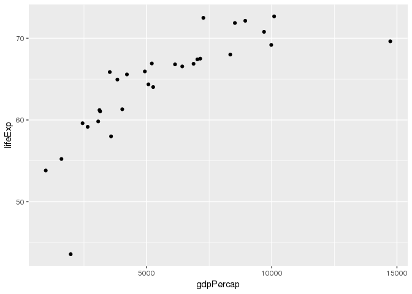
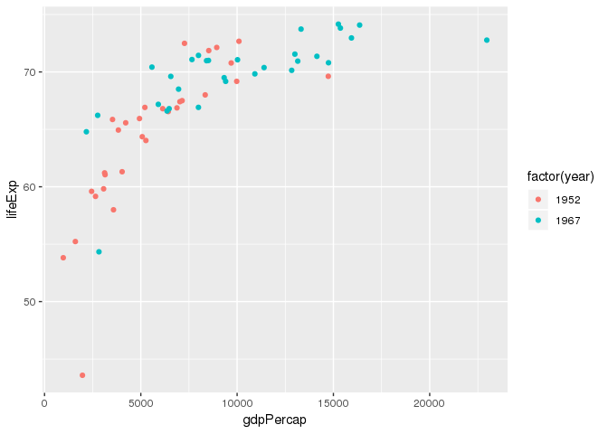

Gapminder Exercise Template
================
Yangfan Ren
2018-08-20

## Load packages

``` r
library(tidyverse)
```

## Load data

``` r
gap <- read_csv("https://bit.ly/gap_data_upd")
```

## Exercises

### Exercise 1

How many observations are in this dataset?

``` r
num_rows <- nrow(gap)
```

There are 1704 observations in the dataset.

### Exercise 2

Visualize the relationship between GDP and life expectancy for countries
in Europe in 1952 using a scatter plot.

<!-- -->

### Exercise 3

Add year 1967 in another color.

``` r
eu_5267 <- gap %>%
  filter(continent == "Europe", year %in% c(1952, 1967))
ggplot(data = eu_5267, aes(x = gdpPercap, y = lifeExp, color = factor(year))) +
  geom_point()  
```

<!-- -->
